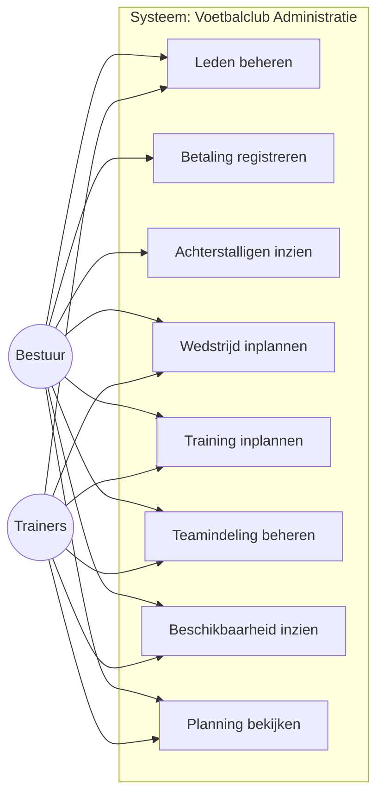
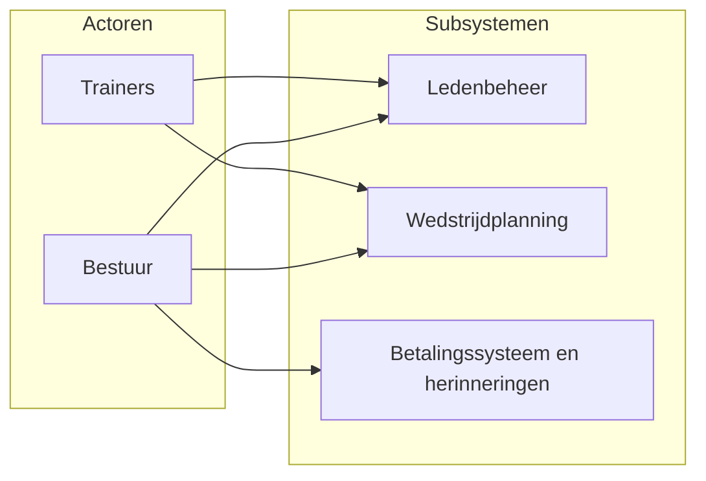

# Analyse: Slimme Voetbalclub Administratie

Het doel van deze analyse is het probleem (en de context) te verduidelijken en een functioneel beeld te geven van hoe het informatiesysteem bijdraagt aan de oplossing. Het resultaat is inzicht voor belanghebbenden in welke wensen en eisen er zijn en hoe het systeem zich gedraagt. Hieronder worden het gedrag van het systeem, de prioritering en validatie van gebruikerseisen beschreven, onder meer met een use case-diagram, verb–noun-analyse, belangrijkste concepten en use case-beschrijvingen.

---

## 1. Basisfunctionaliteiten

De applicatie ondersteunt het dagelijks beheer van een voetbalclub met de volgende hoofdfunctionaliteiten:

- **Ledenbeheer** — Registratie van leden en bijhouden van hun gegevens (naam, contact, lidmaatschap). Bestuur en trainers kunnen leden toevoegen, wijzigen en inzien.

- **Contributie-inning** — Registreren van contributies en betalingen. Automatische herinneringen bij achterstallige betalingen, zodat bestuur inzicht heeft in wie er nog moet betalen.

- **Wedstrijdplanning** — Planning van wedstrijden met inachtneming van de beschikbaarheid van spelers en velden. Database voor teamindelingen, trainingen en wedstrijden.

- **Eenvoudige interface** — Een overzichtelijke interface voor bestuur en trainers om bovenstaande functionaliteit te gebruiken zonder technische voorkennis.

---

## 2. Benodigde gegevens

| Domein | Gegevens |
|--------|----------|
| **Leden** | Naam, contactgegevens, lidmaatschap (status, type) |
| **Contributies / betalingen** | Bedrag, datum, status (betaald/openstaand), koppeling naar lid |
| **Teams** | Naam, categorie, evt. veld of trainer |
| **Lid–Team** | Koppeling welk lid bij welk team hoort (meerdere teams per lid mogelijk) |
| **Beschikbaarheid** | Speler, datum (en evt. tijd/veld) — wie is wanneer beschikbaar |
| **Velden** | Naam/locatie, beschikbaarheid per datum/tijd |
| **Wedstrijden** | Datum, tijd, teams, veld, status |
| **Trainingen** | Datum, tijd, team(s), veld |

Deze gegevens vormen de basis voor het **conceptueel model** (logische structuur van de belangrijkste begrippen), dat in Stap 2 wordt uitgewerkt in een ERD.

---

## 3. Verb–noun-analyse en use cases

Op basis van de basisfunctionaliteiten zijn met een **verb–noun-analyse** de volgende use cases afgeleid. Elk verb–noun-paar beschrijft een handeling die het systeem ondersteunt.

| Verb | Zelfstandig naamwoord | Use case | Actor(s) |
|------|------------------------|----------|----------|
| Beheren | Leden | Leden beheren (aanmaken, wijzigen, inzien) | Bestuur, Trainers |
| Registreren | Contributie / betaling | Betaling registreren | Bestuur |
| Opvragen | Achterstallige betalingen | Achterstalligen inzien / herinneringen | Bestuur |
| Inplannen | Wedstrijd | Wedstrijd inplannen | Bestuur, Trainers |
| Inplannen | Training | Training inplannen | Bestuur, Trainers |
| Beheren | Teamindeling | Leden aan team koppelen | Bestuur, Trainers |
| Opvragen | Beschikbaarheid | Beschikbaarheid spelers/velden inzien | Bestuur, Trainers |
| Inzien | Wedstrijdschema / planning | Planning bekijken | Bestuur, Trainers |

---

## 4. Use case-diagram (UML)

Het onderstaande diagram geeft de actoren en de use cases weer binnen de grenzen van het systeem. De use cases sluiten aan op de verb–noun-analyse en de basisfunctionaliteiten.

*In strikte UML-notatie wordt een use case-diagram met ovalen en een system boundary getekend; bovenstaande weergave in Mermaid geeft dezelfde relaties tussen actoren en use cases weer.*

---

## 5. Use case-beschrijvingen

Enkele use cases zijn hieronder kort uitgewerkt. Deze beschrijvingen maken de gebruikerseisen concreet en kunnen later worden gebruikt voor ontwerp en testcases.

### 5.1 Lid registreren

| Veld | Beschrijving |
|------|--------------|
| **Use case** | Lid registreren |
| **Actor** | Bestuur, Trainers |
| **Doel** | Een nieuw lid in het systeem opnemen met basisgegevens. |
| **Hoofdstroom** | Gebruiker voert naam, contactgegevens en lidmaatschapgegevens in; systeem valideert en slaat het lid op; systeem toont bevestiging. |
| **Alternatief** | Bij ongeldige of ontbrekende gegevens toont het systeem een foutmelding en kan de gebruiker de gegevens aanpassen. |

### 5.2 Betaling registreren

| Veld | Beschrijving |
|------|--------------|
| **Use case** | Betaling registreren |
| **Actor** | Bestuur |
| **Doel** | Een contributiebetaling van een lid vastleggen. |
| **Hoofdstroom** | Gebruiker kiest het lid en voert bedrag en datum in; systeem registreert de betaling en werkt de status van de contributie bij; systeem toont bevestiging. |
| **Alternatief** | Als het lid niet bestaat of gegevens ongeldig zijn, toont het systeem een foutmelding. |

### 5.3 Wedstrijd inplannen

| Veld | Beschrijving |
|------|--------------|
| **Use case** | Wedstrijd inplannen |
| **Actor** | Bestuur, Trainers |
| **Doel** | Een wedstrijd in het schema zetten met datum, tijd, teams en veld, rekening houdend met beschikbaarheid. |
| **Hoofdstroom** | Gebruiker kiest datum, tijd, veld en (eventueel) teams; systeem controleert of het veld vrij is en kan beschikbaarheid van spelers tonen; gebruiker bevestigt; systeem slaat de wedstrijd op. |
| **Alternatief** | Bij conflicten (veld bezet, dubbele planning) toont het systeem een waarschuwing; gebruiker past aan of kiest een andere slot. |

---

## 6. Contextdiagram

Het onderstaande diagram geeft de actoren (bestuur, trainers) en de subsystemen van de applicatie weer, inclusief welke actor welk subsysteem gebruikt.

**Toelichting:**

- **Bestuur** gebruikt alle drie de subsystemen: ledenbeheer (registratie en gegevens), wedstrijdplanning (indeling en planning), en het betalingssysteem (contributies en herinneringen).
- **Trainers** gebruiken met name **ledenbeheer** (leden en teams inzien/wijzigen) en **wedstrijdplanning** (beschikbaarheid en planning). Het betalingssysteem is primair voor bestuur; trainers kunnen indien gewenst alleen inzicht krijgen.
- De subsystemen delen een gemeenschappelijke **database** voor teamindelingen, trainingen, wedstrijden, leden en betalingen (niet apart in het diagram getekend; valt onder de applicatie).

---

## 7. Test cases

De use cases en use case-beschrijvingen vormen de basis voor **test cases** in de realisatiefase. Per use case kunnen testcases worden afgeleid die controleren of het systeem het gewenste gedrag vertoont. Enkele voorbeelden:

| Use case | Voorbeeldtest | Verwachting |
|----------|---------------|-------------|
| Lid registreren | Nieuw lid aanmaken met geldige gegevens | Lid wordt opgeslagen en is zichtbaar in overzicht |
| Lid registreren | Lid aanmaken zonder verplicht veld (bijv. naam) | Foutmelding; geen opslag |
| Betaling registreren | Betaling invoeren voor bestaand lid | Betaling wordt opgeslagen; contributiestatus wordt bijgewerkt |
| Wedstrijd inplannen | Wedstrijd inplannen op moment dat veld vrij is | Wedstrijd wordt opgeslagen in planning |
| Wedstrijd inplannen | Wedstrijd inplannen op moment dat veld bezet is | Waarschuwing of foutmelding; geen dubbele boeking |

Deze testcases worden bij de bouw van de applicatie (Stap 5) gebruikt voor validatie.
