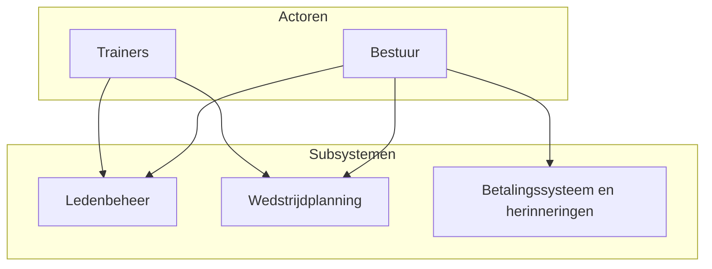

# Analyse: Slimme Voetbalclub Administratie

## 1. Basisfunctionaliteiten

De applicatie ondersteunt het dagelijks beheer van een voetbalclub met de volgende hoofdfunctionaliteiten:

- **Ledenbeheer** — Registratie van leden en bijhouden van hun gegevens (naam, contact, lidmaatschap). Bestuur en trainers kunnen leden toevoegen, wijzigen en inzien.

- **Contributie-inning** — Registreren van contributies en betalingen. Automatische herinneringen bij achterstallige betalingen, zodat bestuur inzicht heeft in wie er nog moet betalen.

- **Wedstrijdplanning** — Planning van wedstrijden met inachtneming van de beschikbaarheid van spelers en velden. Database voor teamindelingen, trainingen en wedstrijden.

- **Eenvoudige interface** — Een overzichtelijke interface voor bestuur en trainers om bovenstaande functionaliteit te gebruiken zonder technische voorkennis.

---

## 2. Benodigde gegevens

| Domein | Gegevens |
|--------|----------|
| **Leden** | Naam, contactgegevens, lidmaatschap (status, type) |
| **Contributies / betalingen** | Bedrag, datum, status (betaald/openstaand), koppeling naar lid |
| **Teams** | Naam, categorie, evt. veld of trainer |
| **Lid–Team** | Koppeling welk lid bij welk team hoort (meerdere teams per lid mogelijk) |
| **Beschikbaarheid** | Speler, datum (en evt. tijd/veld) — wie is wanneer beschikbaar |
| **Velden** | Naam/locatie, beschikbaarheid per datum/tijd |
| **Wedstrijden** | Datum, tijd, teams, veld, status |
| **Trainingen** | Datum, tijd, team(s), veld |

---

## 3. Contextdiagram

Het onderstaande diagram geeft de actoren (bestuur, trainers) en de subsystemen van de applicatie weer, inclusief welke actor welk subsysteem gebruikt.

*De afbeelding hierboven is een weergave van het contextdiagram. Deze is gegenereerd door de Mermaid-code in te voeren op [mermaid.live](https://mermaid.live).

**Toelichting:**

- **Bestuur** gebruikt alle drie de subsystemen: ledenbeheer (registratie en gegevens), wedstrijdplanning (indeling en planning), en het betalingssysteem (contributies en herinneringen).
- **Trainers** gebruiken met name **ledenbeheer** (leden en teams inzien/wijzigen) en **wedstrijdplanning** (beschikbaarheid en planning). Het betalingssysteem is primair voor bestuur; trainers kunnen indien gewenst alleen inzicht krijgen.
- De subsystemen delen een gemeenschappelijke **database** voor teamindelingen, trainingen, wedstrijden, leden en betalingen (niet apart in het diagram getekend; valt onder de applicatie).
