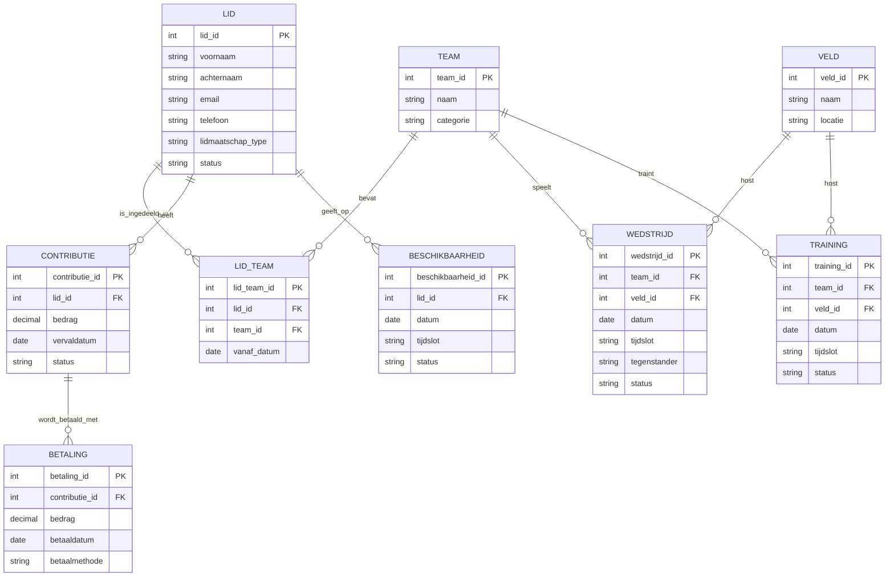

# Stap 2: Conceptueel model (ERD)

In deze stap wordt vastgelegd welke kerngegevens de applicatie opslaat en hoe deze gegevens met elkaar samenhangen. Het doel is een helder conceptueel model dat aansluit op de analyse en als basis dient voor het datamodel in Stap 3.

---

## 1. Entiteiten en relaties

De belangrijkste entiteiten uit de analyse zijn:

- **Lid** - persoonsgegevens en lidmaatschapsgegevens
- **Team** - teamnaam en categorie
- **LidTeam** - koppeling tussen leden en teams (many-to-many)
- **Contributie** - verschuldigde contributie per periode
- **Betaling** - geregistreerde betalingen van contributies
- **Veld** - beschikbare speelvelden
- **Beschikbaarheid** - beschikbaarheid van een lid op datum/tijd
- **Wedstrijd** - ingeplande wedstrijd met datum, tijd en status
- **Training** - ingeplande training met datum en tijd

---

## 2. ERD (conceptueel)

---

## 3. Korte toelichting

- Een **lid** kan in meerdere teams zitten en een **team** bestaat uit meerdere leden; daarom is er een koppelentiteit **LidTeam**.
- Per lid worden een of meer **contributies** vastgelegd. Een contributie kan in een of meerdere termijnen worden betaald via **betalingen**.
- **Wedstrijden** en **trainingen** zijn gekoppeld aan een team en worden op een veld gepland.
- **Beschikbaarheid** wordt per lid opgeslagen zodat planning rekening kan houden met aanwezigheid.
- Dit model blijft binnen de afgesproken scope: kernadministratie voor leden, contributie en planning, zonder externe koppelingen of uitgebreide rollenstructuur.

Dit ERD vormt de basis voor het relationele datamodel en het SQL-schema in Stap 3.
