# Stap 4: Klassendiagram (Hoe is de code gestructureerd?)

In deze stap wordt het domeinmodel vertaald naar een UML-klassendiagram voor de C#-applicatie. Het doel is om duidelijk te maken welke objecten nodig zijn, welke attributen ze bevatten en welke methoden de kernfunctionaliteit ondersteunen.

---

## 1. UML klassendiagram

```mermaid
classDiagram
    class Lid {
        +int LidId
        +string Voornaam
        +string Achternaam
        +string Email
        +string Telefoon
        +string LidmaatschapType
        +string Status
    }

    class Team {
        +int TeamId
        +string Naam
        +string Categorie
    }

    class LidTeam {
        +int LidTeamId
        +int LidId
        +int TeamId
        +DateTime VanafDatum
    }

    class Contributie {
        +int ContributieId
        +int LidId
        +decimal Bedrag
        +DateTime Vervaldatum
        +string Status
        +decimal OpenstaandBedrag()
    }

    class Betaling {
        +int BetalingId
        +int ContributieId
        +decimal Bedrag
        +DateTime Betaaldatum
        +string Betaalmethode
    }

    class Veld {
        +int VeldId
        +string Naam
        +string Locatie
    }

    class Beschikbaarheid {
        +int BeschikbaarheidId
        +int LidId
        +DateTime Datum
        +string Tijdslot
        +string Status
    }

    class Wedstrijd {
        +int WedstrijdId
        +int TeamId
        +int VeldId
        +DateTime Datum
        +string Tijdslot
        +string Tegenstander
        +string Status
    }

    class Training {
        +int TrainingId
        +int TeamId
        +int VeldId
        +DateTime Datum
        +string Tijdslot
        +string Status
    }

    class LidService {
        +void RegistreerLid(Lid lid)
        +void WijzigLid(Lid lid)
        +List~Lid~ HaalLedenOp()
        +void KoppelLidAanTeam(int lidId, int teamId)
    }

    class BetalingService {
        +void RegistreerBetaling(Betaling betaling)
        +List~Contributie~ HaalAchterstalligeContributiesOp()
        +void WerkContributieStatusBij(int contributieId)
    }

    class PlanningService {
        +void PlanWedstrijd(Wedstrijd wedstrijd)
        +void PlanTraining(Training training)
        +bool IsVeldBeschikbaar(int veldId, DateTime datum, string tijdslot)
        +List~Wedstrijd~ HaalPlanningOp()
    }

    class LidRepository {
        +void Insert(Lid lid)
        +void Update(Lid lid)
        +List~Lid~ GetAll()
    }

    class BetalingRepository {
        +void Insert(Betaling betaling)
        +List~Contributie~ GetAchterstallig()
        +void UpdateContributieStatus(int contributieId, string status)
    }

    class PlanningRepository {
        +void InsertWedstrijd(Wedstrijd wedstrijd)
        +void InsertTraining(Training training)
        +bool BestaatVeldConflict(int veldId, DateTime datum, string tijdslot)
        +List~Wedstrijd~ GetPlanning()
    }

    Lid "1" --> "0..*" Contributie : heeft
    Contributie "1" --> "0..*" Betaling : wordt_betaald_met
    Lid "1" --> "0..*" Beschikbaarheid : geeft_op
    Lid "1" --> "0..*" LidTeam : heeft
    Team "1" --> "0..*" LidTeam : bevat
    Team "1" --> "0..*" Wedstrijd : speelt
    Team "1" --> "0..*" Training : traint
    Veld "1" --> "0..*" Wedstrijd : host
    Veld "1" --> "0..*" Training : host

    LidService --> LidRepository : gebruikt
    BetalingService --> BetalingRepository : gebruikt
    PlanningService --> PlanningRepository : gebruikt
```

---

## 2. Korte toelichting

- De domeinklassen (`Lid`, `Team`, `Contributie`, `Wedstrijd`, enz.) sluiten direct aan op het ERD en SQL-datamodel uit stap 2 en 3.
- De serviceklassen bundelen de use cases uit de analyse: leden beheren, betalingen registreren/achterstalligen bepalen, en wedstrijden/trainingen plannen.
- De repositoryklassen verzorgen database-toegang via ADO.NET en houden SQL-logica gescheiden van de domein- en servicelogica.
- Deze structuur maakt de code overzichtelijk, testbaar en passend binnen de prototype-scope zonder ORM.
